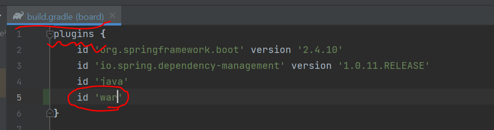
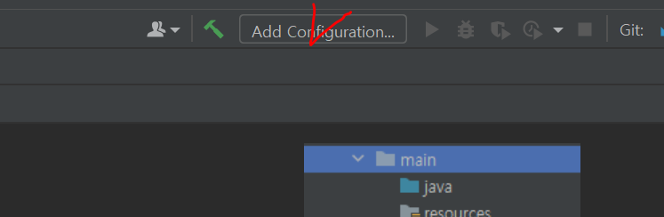
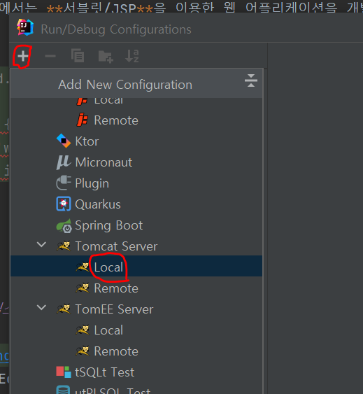
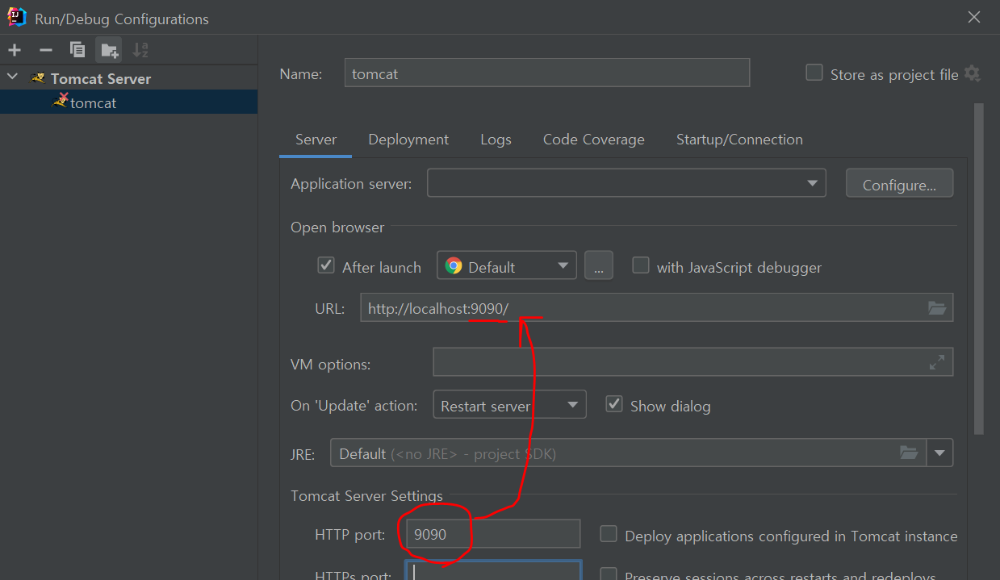
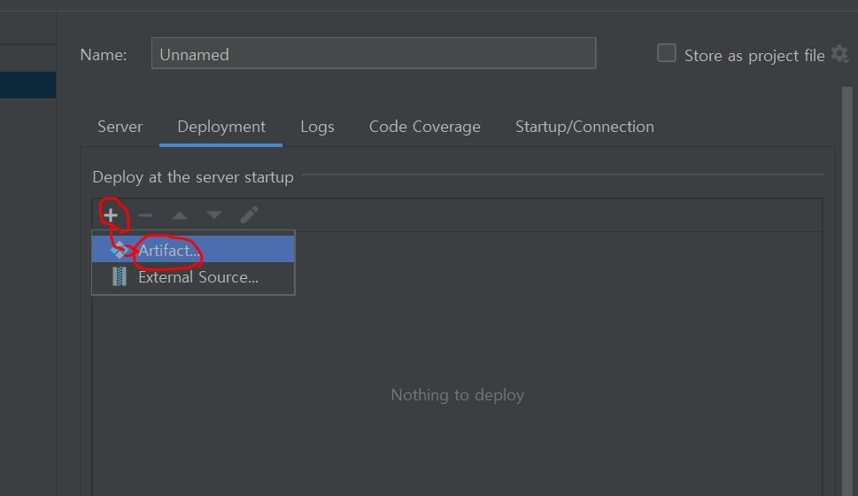
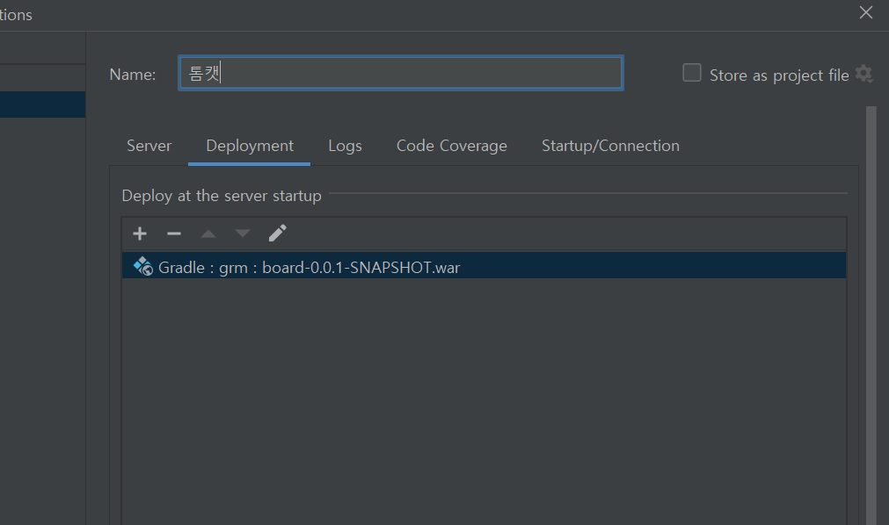
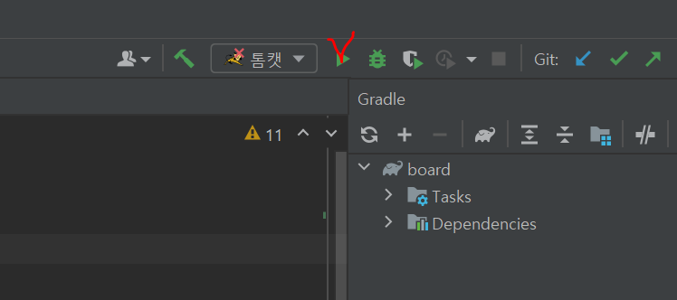
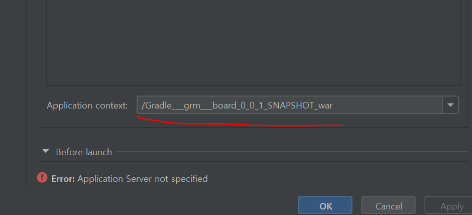

# CH9. 스프링 MVC 시작하기

## 프로젝트 생성하기 

<center></center><br>

> webapp은 HTML, CSS, JS, JSP 등 웹 어플리케이션을 구현하는데 필요한 코드가 위치한다.<br>
WEB-INF에는 web.xml파일이 위치한다.

<br>

이번 챕터에서는 **서블릿/JSP**을 이용한 웹 어플리케이션을 개발할 것이므로 `war`을 넣어주자~!



<br>

## 이클립스 톰캣 설정


상단의 Edit Configurations를 클릭해서 Tomcat을 추가한다.

<br>




`+버튼`을 눌러서 Tomcat Server > Local로 선택하고 저장한다.

<br>


`server > Http port`에 새로운 포트 번호를 넣어준다. 현재 9090으로 넣었다
(DB와의 충돌 예방) 

<br>





<br>




톰캣 서버를 실행한다. (Appilcation context를 / 로 수정하지 않으면 주소 뒤에 초기의 Application context가 따라 붙는다.)


<br>

> 스프링 MVC 추가, 스프링 MVC를 위한 설정 XML 파일 생성 <br>
> (root-context.xml, servlet-context.xml, web.xml)

MVC를 사용하기 위해서 spring.webmvc를 추가한다.
```java
// build.gradle
compile group: 'org.springframework', name: 'spring-webmvc', version: '5.2.3.RELEASE'
```

<br>

### webapp 폴더에 필요한 폴더 구조를 생성해서 만든다.

**폴더 구조**
* src / main / java
* src / main / webapp
* src / main / webapp / WEB-INF
* src / main / webapp / WEB-INF / spring
* src / main / webapp / WEB-INF / view

webapp은 HTML,CSS, JS,JSP 등 웹 어플리케이션을 구현하는데 필요한 코드가 위치하고,
WEB-INFO에는 web.xml 파일이 위치한다.


<br>

* root-context.xml
  (/WEB-INF/spring 폴더 아래에 위치 시킨다.)

```java
<?xml version="1.0" encoding="UTF-8"?>
<beans xmlns="http://www.springframework.org/schema/beans"
       xmlns:xsi="http://www.w3.org/2001/XMLSchema-instance"
       xsi:schemaLocation="http://www.springframework.org/schema/beans http://www.springframework.org/schema/beans/spring-beans.xsd">

</beans>
```

<br>

* servlet-context.xml
  (/WEB-INF/spring/appServlet 폴더에 위치 시킨다.)
```java
<?xml version="1.0" encoding="UTF-8"?>
<beans xmlns="http://www.springframework.org/schema/beans"
       xmlns:mvc="http://www.springframework.org/schema/mvc"
       xmlns:xsi="http://www.w3.org/2001/XMLSchema-instance"
       xmlns:context="http://www.springframework.org/schema/context"
       xsi:schemaLocation="http://www.springframework.org/schema/beans
        http://www.springframework.org/schema/beans/spring-beans.xsd
        http://www.springframework.org/schema/mvc
        http://www.springframework.org/schema/mvc/spring-mvc.xsd
        http://www.springframework.org/schema/context http://www.springframework.org/schema/context/spring-context.xsd">
    <mvc:annotation-driven />

    <bean class="org.springframework.web.servlet.view.InternalResourceViewResolver">
        <property name="prefix" value="/WEB-INF/views/"/>
        <property name="suffix" value=".jsp"/>
    </bean>


    <context:component-scan base-package="config"/>


</beans>
```

<br>

web.xml에 root-context와, servlet-context를 등록해준다.


<br><br>

#### MVC 기반으로 잘 돌아가는지 확인하기 위해 controller와 view 파일을 만든다.
```java
@Controller
 
public class HelloController {
 
    @GetMapping("/hello")
    public String hello(Model model,
                        @RequestParam(value = "name", required = false) String name) {
        model.addAttribute("greeting", "안녕하세요, " + name);
        System.out.println("hello");
        return "hello";
    }
 
}
```

> localhost:9090/hello?name=Ohyaelim

GetMapping 어노테이션 값으로 들어가는 hello, RequestParam 어노테이션 value속성은 HTTP 요청 파라미터의 이름을 지정하고 required 속성은 필수 여부를 지정한다. <br>
name 요청 파라미터의 값인 Ohyaelim이 hello() 메서드의 name 파라미터에 전달된다.
<br><br>

**Model의 addAttribute() 메서드**
<br>
첫번째 파라미터는 데이터를 식별하는데 사용되는 속성 이름이고 두번째 파라미터는 속성 이름에 해당하는 값이다. 뷰 코드는 이 속성 이름을 
사용해서 컨트롤러가 전달한 데이터에 접근하게 된다. 
<br>
GetMapping 어노테이션이 붙은 메서드는 컨트롤러의 실행 결과를 보여줄 뷰 이름을 리턴한다. 
이 뷰 이름은 논리적인 이름이며 실제로 뷰 이름에 해당하는 뷰 구현을 찾아주는 것은 ViewResolver가 처리한다.

<br>
<Br>

* ControllerConfig.java
```java
@Configuration
public class ControllerConfig {

    @Bean
    public HelloController helloController() {
        return new HelloController();
    }
}
```

<br>

* hello.jsp
```java
<%@ page contentType="text/html;charset=UTF-8" language="java" %>
<html>
<head>
    <title>Title</title>
</head>
<body>
    인사말: ${greeting}
</body>
</html>
```